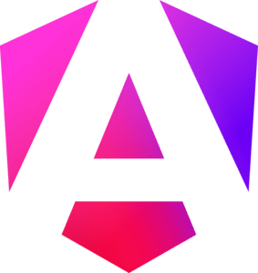

# 👋 Hi, I’m Paia-Ea-Salanmi Sumer Lyngdoh Talang
- 😀 I'm currently working as an IT Support Professional cum Software Programmer for the National Hydrology Project (NHP), Shillong, Meghalaya, India
- 👀 I’m interested in Web Development, Game Development, Software Development & Graphic Design
- 🌱 I’m currently learning about Angular, Deno, Tailwind CSS, among other things
- 💞️ I’m looking to collaborate on some Web Related Projects
- 📫 How to reach me paiasltpc@gmail.com

## Languages & Skills
### Web Development
- **Fundamentals** :
    - HTML 
    - CSS 
    - JavaScript 
    - TypeScript 
    - PHP 
- **Frameworks** :
    - Angular 
### Software Development
- **Core** :
    - Java 
    - C 
    - Kotlin 
- **Frameworks** :
    - Spring MVC with Hibernate 
    - Spring Boot 
- **Query Languages (DBMS)**
    - MySQL 
    - PostgreSQL 
- **Android Applications**
    - Android Studio with Kotlin 